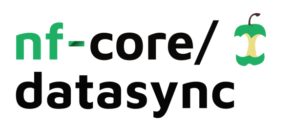

<h1>
  <picture>
    <source media="(prefers-color-scheme: dark)" srcset="docs/images/nf-core-datasync_logo_dark.png">
    
  </picture>
</h1>

[](https://github.com/nf-core/datasync/actions/workflows/ci.yml)
[](https://github.com/nf-core/datasync/actions/workflows/linting.yml)[](https://nf-co.re/datasync/results)[](https://doi.org/10.5281/zenodo.XXXXXXX)

[](https://www.nextflow.io/)
[](https://docs.conda.io/en/latest/)
[](https://www.docker.com/)
[](https://sylabs.io/docs/)
[](https://tower.nf/launch?pipeline=https://github.com/nf-core/datasync)

[](https://nfcore.slack.com/channels/datasync)[](https://twitter.com/nf_core)[](https://mstdn.science/@nf_core)[](https://www.youtube.com/c/nf-core)

## Introduction

**nf-core/datasync** is a system operation pipeline that provides several workflows for handling system operation / automation tasks that are commonly helpful for various tasks in large data processing / analysis facilities. This includes:

- Data Synchronization & Checksum generation
  - Configurable: Can provide YAML file which files to include or exclude from sync
  - Checksum backend: Can configure which backend to use for checksum generation (e.g. sha256sum, md5, ...)
  - Configurable whether to include (sub-) folders in the sync or not (search for checkpoint files, e.g. has to have DEMUX_DONE that signals a demultiplexing run was finished & successfully copied)
- Data Integrity validation
  - Provided with a directory to check, can validate that file(s) found are matching checksums from Synchronization subworkflow
- Data Archival & Deletion
  - Can check source and target location for existence of file(s) and decide based on user configurable rules whether files can be considered archived
    - Timestamp older than X days
    - Checksums match Integrity validation report
    - Create empty files to make it obvious that archival was performed
    - Optionally: Delete files or create list of files to be deleted for manual deletion process

The pipeline can be configured by users to execute any of the aforementioned subworkflows and then produces a report using MultiQC custom content that also serves as a report of _what_ was done by the pipeline for documentation purposes.

## Usage

> [!NOTE]
> If you are new to Nextflow and nf-core, please refer to [this page](https://nf-co.re/docs/usage/installation) on how to set-up Nextflow. Make sure to [test your setup](https://nf-co.re/docs/usage/introduction#how-to-run-a-pipeline) with `-profile test` before running the workflow on actual data.

Now, you can run the pipeline using:

```bash
nextflow run nf-core/datasync \
   -profile <docker/singularity/.../institute> \
   --input samplesheet.csv \
   --outdir <OUTDIR>
   --sync
   --sync_backend 'sha256'
   --sync_done true #Creates SYNC_DONE file when done in each folder
```

> [!WARNING]
> Please provide pipeline parameters via the CLI or Nextflow `-params-file` option. Custom config files including those provided by the `-c` Nextflow option can be used to provide any configuration _**except for parameters**_;
> see [docs](https://nf-co.re/usage/configuration#custom-configuration-files).

For more details and further functionality, please refer to the [usage documentation](https://nf-co.re/datasync/usage) and the [parameter documentation](https://nf-co.re/datasync/parameters).

## Pipeline output

To see the results of an example test run with a full size dataset refer to the [results](https://nf-co.re/datasync/results) tab on the nf-core website pipeline page.
For more details about the output files and reports, please refer to the
[output documentation](https://nf-co.re/datasync/output).

## Credits

nf-core/datasync was originally written by Alexander Peltzer.

We thank the following people for their extensive assistance in the development of this pipeline:

<!-- TODO nf-core: If applicable, make list of people who have also contributed -->

## Contributions and Support

If you would like to contribute to this pipeline, please see the [contributing guidelines](.github/CONTRIBUTING.md).

For further information or help, don't hesitate to get in touch on the [Slack `#datasync` channel](https://nfcore.slack.com/channels/datasync) (you can join with [this invite](https://nf-co.re/join/slack)).

## Citations

<!-- TODO nf-core: Add citation for pipeline after first release. Uncomment lines below and update Zenodo doi and badge at the top of this file. -->
<!-- If you use nf-core/datasync for your analysis, please cite it using the following doi: [10.5281/zenodo.XXXXXX](https://doi.org/10.5281/zenodo.XXXXXX) -->

<!-- TODO nf-core: Add bibliography of tools and data used in your pipeline -->

An extensive list of references for the tools used by the pipeline can be found in the [`CITATIONS.md`](CITATIONS.md) file.

You can cite the `nf-core` publication as follows:

> **The nf-core framework for community-curated bioinformatics pipelines.**
>
> Philip Ewels, Alexander Peltzer, Sven Fillinger, Harshil Patel, Johannes Alneberg, Andreas Wilm, Maxime Ulysse Garcia, Paolo Di Tommaso & Sven Nahnsen.
>
> _Nat Biotechnol._ 2020 Feb 13. doi: [10.1038/s41587-020-0439-x](https://dx.doi.org/10.1038/s41587-020-0439-x).
