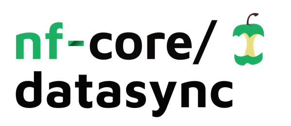
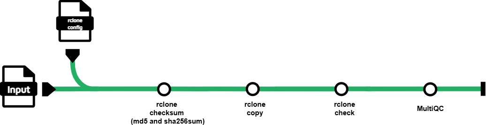

<h1>
  <picture>
    <source media="(prefers-color-scheme: dark)" srcset="docs/images/nf-core-datasync_logo_dark.png">
    
  </picture>
</h1>

[](https://github.com/codespaces/new/nf-core/datasync)
[](https://github.com/nf-core/datasync/actions/workflows/nf-test.yml)
[](https://github.com/nf-core/datasync/actions/workflows/linting.yml)[](https://nf-co.re/datasync/results)[](https://doi.org/10.5281/zenodo.XXXXXXX)
[](https://www.nf-test.com)

[](https://www.nextflow.io/)

[](https://github.com/nf-core/tools/releases/tag/4.0.3)

[](https://docs.conda.io/en/latest/)
[](https://www.docker.com/)
[](https://sylabs.io/docs/)
[](https://cloud.seqera.io/launch?pipeline=https://github.com/nf-core/datasync)

[](https://nfcore.slack.com/channels/datasync)[](https://bsky.app/profile/nf-co.re)[](https://mstdn.science/@nf_core)[](https://www.youtube.com/c/nf-core)

## Introduction

**nf-core/datasync** is a Nextflow pipeline for copying files and directories between storage locations and documenting their integrity. For every row in an input samplesheet, the pipeline:

1. validates the source against a supplied MD5 and/or SHA-256 checksum manifest using [`rclone checksum`](https://rclone.org/commands/rclone_checksum/);
2. copies the source to the requested destination with [`rclone copy`](https://rclone.org/);
3. compares the copied data with the source using [`rclone check`](https://rclone.org/commands/rclone_check/); and
4. produces detailed `rclone` status files and a consolidated MultiQC report.

Sources and destinations may be local paths or object-storage URIs such as Amazon S3, S3-compatible storage, or Azure Blob Storage. HTTP(S) URLs are not currently supported for samplesheet `input` or `output_path` values.

The current tested use case for this pipeline is transfer between S3 buckets.

Pass an `rclone` configuration with `--rclone_config` whenever a source or destination URI needs credentials or provider settings. Samplesheet paths use local paths or standard URIs such as `s3://bucket/path`, not rclone's `remote:path` syntax. For non-S3 layouts, design and validate the provider-specific configuration using the upstream [rclone documentation](https://rclone.org/docs/).



## Quick start

> [!NOTE]
> If you are new to Nextflow and nf-core, see the [nf-core environment setup guide](https://nf-co.re/docs/get_started/environment_setup/overview). Nextflow 25.10.4 or later is required.

To explore the pipeline outputs before preparing your own data, run the bundled `test` profile with a container profile:

```bash
nextflow run nf-core/datasync \
    -profile test,docker \
    --outdir results
```

The `test` profile supplies a small samplesheet and `rclone` configuration automatically. It also enables `--rclone_dry_run`, so no files are actually transferred. This makes it useful for exploring the `rclone/` output folders and `multiqc/multiqc_report.html`; remember that post-copy comparison reports describe whatever is already present at the destination because the dry run does not write transfer data.

To run the pipeline on your own data, create a samplesheet containing one transfer per row:

```csv
sample,input,output_path,checksum_md5,checksum_sha
run_001,/data/run_001,s3://archive/runs,/data/manifests/run_001_md5.tsv
reference,/data/reference.fa,/data/references,,/data/manifests/reference_sha256.tsv
```

Then launch the pipeline using:

```bash
nextflow run nf-core/datasync \
    -r <VERSION> \
    -profile docker \
    --input samplesheet.csv \
    --outdir results \
    --rclone_config /path/to/rclone.conf
```

`--rclone_config` is optional only when every source and destination is accessible without a configured rclone remote. See the [`rclone` configuration section](docs/usage.md#configuring-rclone-remotes) for the tested S3-to-S3 use case and guidance on adapting rclone configuration files for other providers. To preview copy operations without transferring data, add `--rclone_dry_run`; note that subsequent comparison reports will then describe the unchanged destination.

See the [usage documentation](docs/usage.md) for samplesheet rules, destination semantics, remote configuration, and reproducible execution. The complete generated parameter reference is available on the [nf-core pipeline page](https://nf-co.re/datasync/parameters).

## Pipeline output

Results are written below `--outdir`. See the [output documentation](docs/output.md) for file names and status-code interpretation.

## Credits

nf-core/datasync was originally written by Alexander Peltzer.

We thank the following people for their extensive assistance in the development of this pipeline:

- Julian Schwab
- Gregor Sturm
- Antonia Saracco
- Delfina Terradas
- Anabella Trigila

## Contributions and Support

If you would like to contribute to this pipeline, please see the [contributing guidelines](docs/CONTRIBUTING.md).

For further information or help, don't hesitate to get in touch on the [Slack `#datasync` channel](https://nfcore.slack.com/channels/datasync) (you can join with [this invite](https://nf-co.re/join/slack)).

## Citations

<!-- TODO nf-core: Add citation for pipeline after first release. Uncomment lines below and update Zenodo doi and badge at the top of this file. -->
<!-- If you use nf-core/datasync for your analysis, please cite it using the following doi: [10.5281/zenodo.XXXXXX](https://doi.org/10.5281/zenodo.XXXXXX) -->

An extensive list of references for the tools used by the pipeline can be found in the [`CITATIONS.md`](CITATIONS.md) file.

You can cite the `nf-core` publication as follows:

> **The nf-core framework for community-curated bioinformatics pipelines.**
>
> Philip Ewels, Alexander Peltzer, Sven Fillinger, Harshil Patel, Johannes Alneberg, Andreas Wilm, Maxime Ulysse Garcia, Paolo Di Tommaso & Sven Nahnsen.
>
> _Nat Biotechnol._ 2020 Feb 13. doi: [10.1038/s41587-020-0439-x](https://dx.doi.org/10.1038/s41587-020-0439-x).
