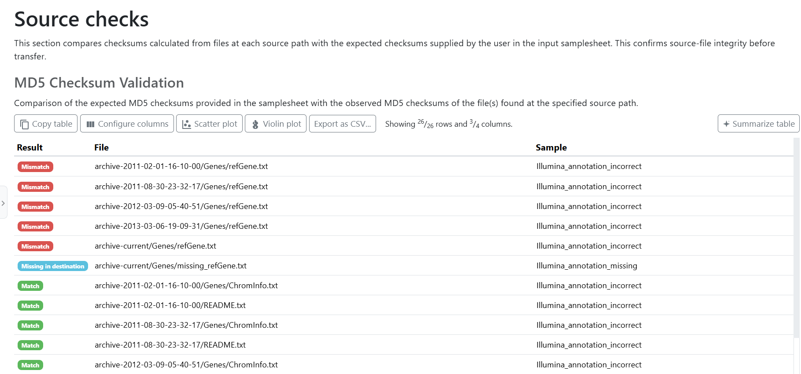
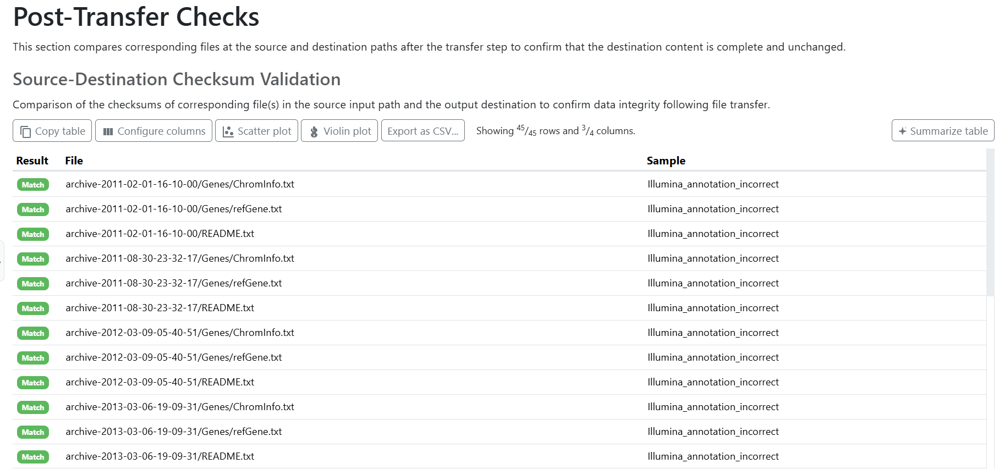

# nf-core/datasync: Output

## Introduction

This document describes the reports produced by nf-core/datasync. Paths below are relative to the directory supplied with `--outdir`.

> [!IMPORTANT]
> The copied payload is written to each samplesheet row's `output_path`. It is not placed in `--outdir` unless `output_path` explicitly points there.

## Output overview

```text
<OUTDIR>/
├── rclone/
│   ├── copy/
│   │   └── <sample>-rclone-copy.log
│   ├── checksum/
│   │   └── <sample>/
│   │       ├── <sample>.combined.txt
│   │       ├── <sample>.match.txt
│   │       ├── <sample>.differ.txt
│   │       ├── <sample>.missing_on_dst.txt
│   │       ├── <sample>.missing_on_src.txt
│   │       └── <sample>.error.txt
│   └── check/
│       └── <sample>/
│           ├── <sample>.combined.txt
│           ├── <sample>.match.txt
│           ├── <sample>.differ.txt
│           ├── <sample>.missing_on_dst.txt
│           ├── <sample>.missing_on_src.txt
│           └── <sample>.error.txt
├── multiqc/
│   ├── multiqc_report.html
│   └── multiqc_data/
└── pipeline_info/
    ├── nf_core_datasync_software_mqc_versions.yml
    └── execution_* / pipeline_dag_*
```

The `rclone/` directory is split by module stage. Copy logs are published to `rclone/copy/`, pre-copy checksum validation reports are published to `rclone/checksum/<sample>/`, and post-copy source-to-destination comparison reports are published to `rclone/check/<sample>/`. The `<sample>` directory name is taken from the `sample` value in the samplesheet row.

## `rclone` directory

<details markdown="1">
<summary>Output files</summary>

- `rclone/copy/`
  - `<sample>-rclone-copy.log`: informational log from the copy operation.
- `rclone/checksum/<sample>/`
  - `<sample>.combined.txt`: combined pre-copy checksum-validation status, one path per line.
  - `<sample>.match.txt`: paths whose content matched the supplied checksum manifest (`=`).
  - `<sample>.differ.txt`: paths present in the source and manifest but with different content (`*`).
  - `<sample>.missing_on_dst.txt`: paths present in the checksum manifest but absent from the checked source (`-`).
  - `<sample>.missing_on_src.txt`: paths present in the checked source but absent from the checksum manifest (`+`).
  - `<sample>.error.txt`: paths that could not be read or hashed (`!`).
- `rclone/check/<sample>/`
  - `<sample>.combined.txt`: combined post-copy source-to-destination comparison status, one path per line.
  - `<sample>.match.txt`: paths whose content matched between source and destination (`=`).
  - `<sample>.differ.txt`: paths present on both sides but with different content (`*`).
  - `<sample>.missing_on_dst.txt`: paths found in the source but absent from the destination (`-`).
  - `<sample>.missing_on_src.txt`: paths found at the destination but absent from the source (`+`).
  - `<sample>.error.txt`: paths that could not be read or hashed (`!`).

</details>

Two integrity stages create reports:

1. **Pre-copy checksum validation** uses each supplied MD5 and/or SHA-256 manifest to check the source and publishes reports under `rclone/checksum/<sample>/`.
2. **Post-copy validation** compares the source with the destination after the copy task finishes and publishes reports under `rclone/check/<sample>/`.

Both stages use the same `<sample>.*.txt` naming convention and publish to `rclone/`. When a row supplies a checksum manifest, similarly named pre-copy and post-copy files may target the same published path; use the consolidated MultiQC sections for the stage-specific summary and retain the Nextflow work directory if both raw report sets must be audited independently.

The combined files use `rclone`'s one-character status prefixes:

| Prefix | Meaning                  | Action                                                                                                                      |
| ------ | ------------------------ | --------------------------------------------------------------------------------------------------------------------------- |
| `=`    | File matches             | No action required.                                                                                                         |
| `-`    | Missing from destination | Investigate an incomplete source checksum set or transfer.                                                                  |
| `+`    | Missing from source      | Review unexpected destination content. The post-copy check uses `--one-way`, so destination-only files are tolerated there. |
| `*`    | Content differs          | Re-copy or investigate source/destination mutation.                                                                         |
| `!`    | Read/hash error          | Inspect permissions, credentials, connectivity, and the copy log.                                                           |

Empty category files mean that `rclone` reported no entries in that category. The commands are designed to preserve these reports rather than terminate the whole workflow on comparison differences. Always inspect the reports; workflow success alone is not an integrity guarantee.

## MultiQC

<details markdown="1">
<summary>Output files</summary>

- `multiqc/`
  - `multiqc_report.html`: standalone report viewable in a browser.
  - `multiqc_data/`: machine-readable data, logs, source inventory, software versions, and parsed rclone tables.

</details>

The MultiQC report consolidates:

- checksum validation status for MD5 and/or SHA-256 manifests generated from `rclone checksum`;
- post-copy source-to-destination validation status generated from `rclone check`;
- the validated samplesheet and workflow parameter summary; and
- pipeline and tool versions.

### `rclone checksum` section (source integrity checks)

The MD5 and SHA-256 input-validation sections show the results from [`rclone checksum`](https://rclone.org/commands/rclone_checksum/). Use these sections to confirm that each source file matched the checksum manifest supplied in `checksum_md5` and/or `checksum_sha` before copying.

When a samplesheet `input` points to S3, `rclone checksum` can normally validate MD5 manifests from S3 object hashes, but S3 does not provide SHA-256 object hashes for rclone to read remotely. SHA-256 validation for S3 inputs therefore requires `rclone checksum --download`, which downloads object data and calculates the hash locally during validation. Configure the checksum process to pass `--download` when SHA-256 validation is required for S3 inputs; see the [`rclone checksum` --download documentation](https://rclone.org/commands/rclone_checksum/).



### `rclone check` section (post-transfer checks)

The source-destination validation section shows the results from `rclone check` after the copy step. Use this section to confirm that copied files at `output_path` match the corresponding source files.



Open `multiqc_report.html` after every run and investigate any non-matching, missing, or error entries. In the `rclone` result sections, entries are prioritised so rows needing attention are shown before successful matches: errors, mismatches, and missing-file statuses appear ahead of matching files. Data under `multiqc_data/` can be retained for automated auditing or downstream reporting; exact filenames may vary with the MultiQC version and the checksum types present in the samplesheet.

## Pipeline information

<details markdown="1">
<summary>Output files</summary>

- `pipeline_info/`
  - `nf_core_datasync_software_mqc_versions.yml`: versions of the pipeline and tools collected for MultiQC.
  - `execution_timeline_<timestamp>.html`: chronological task execution view.
  - `execution_report_<timestamp>.html`: task runtime and resource report.
  - `execution_trace_<timestamp>.txt`: tabular task-level execution trace.
  - `pipeline_dag_<timestamp>.html`: workflow dependency graph.
  - Completion reports generated when `--email` or `--email_on_fail` is configured may also be present.

</details>

These files provide operational provenance and help diagnose performance or failures. Archive them with the MultiQC and rclone reports. The Nextflow `work/` directory and `.nextflow.log` remain in the launch directory rather than `--outdir`; keep them until transfer verification is complete if detailed troubleshooting or `-resume` may be needed.

The supplied rclone configuration is an input credential file and is not intentionally copied to `--outdir`. Nevertheless, execution logs may contain remote names and object paths. Review logs before sharing them, and manage `rclone.conf` separately as a secret.
